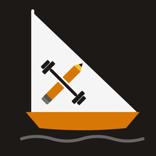

<p align="center">
  
</p>

<h1 align="center">Yawl</h1>

<p align="center"><em>Yet another workout logger.</em></p>

A single-purpose iPhone app for logging barbell training: what you lifted, for
how many reps, at what RPE — and what to do about it next session. No account,
no sync, no subscription. Everything lives on the device.

It exists because a workout log has to work in a gym basement with no signal,
with sweaty hands, in the ninety seconds between sets. That rules out most web
apps, and the rest-timer requirement rules out all of them: the alert has to
fire with the phone locked in a bag.

---

## What it does

**Logging.** Pick a training day from your template, and it pre-fills each
exercise with the set/rep structure you used last time. Enter weight, reps, RPE.
The set grid is the whole interface.

**Tells you what to lift.** Every strength exercise carries a suggestion built
from your own history. Give an exercise a rep range and an RPE ceiling and it
runs double progression — fill the range at or under the cap, then add weight.
Without a target it falls back to an estimated-1RM trend heuristic. Weights
round to something you can actually load.

**Rest timer that survives a locked screen.** Local notification, fires with the
app backgrounded. It announces the *next* set by name and weight, and carries a
text-input action — reply with an RPE from the lock screen or an Apple Watch and
it logs against the correct set, then starts the next rest period.

**Heart rate from HealthKit.** Per-set HR is stamped at RPE entry and backfilled
at session end from the full sample list, which works around Watch→iPhone sync
latency. Fails silently by design — a missing Watch never interrupts a workout.

**Progression machinery.** Deload mode rewrites the day to 60% of top-set weight
capped at two sets, and is excluded from suggestions and PR detection. Linked
exercises derive their weight from a fraction of another lift (RDL at 0.75 ×
deadlift) and re-derive every session. Estimated 1RM is Epley, and drives
records, PR detection, and the trend heuristic.

**Records, history, export.** Best set per exercise by e1RM with a per-exercise
trend, history as a list or a calendar, and JSON export/import — your data
leaves whenever you want it to.

**kg or lb.** Weights are stored canonically in kilograms and converted for
display, so switching units never rewrites what you logged and your PRs stay
comparable. The unit drives stepper increments, plate rounding, and the warm-up
ramp's bar weight (20 kg / 45 lb).

---

## Requirements

Building this needs a Mac. There is no Android target and no hosted version.

| | |
|---|---|
| macOS with **Xcode** | 26.x known good; open it once to accept the license |
| **Node** | 18+ (developed on 26.x) |
| **CocoaPods** | `brew install cocoapods` |
| An **Apple ID** | free tier is fine — see the 7-day caveat below |
| An **iPhone** | HealthKit and notifications do not work correctly in the Simulator |

---

## Dev setup

**All commands run from `native-ios/`.** The repository root holds a stale
earlier copy of the web app (`index.html`, `storage.js`, `notifications.js`,
`package.json`) with no `src/` directory — `npm run dev` at the root will fail.
Treat the root copies as dead.

```bash
git clone git@github.com:jonuts/yawl.git
cd yawl/native-ios
npm install
```

The `ios/` directory is committed, so there is no `npx cap add ios` step.

### The fast loop: browser

```bash
npm run dev
```

Vite on `localhost:5173`. Best for anything UI — layout, state, the training
logic. Capacitor Preferences falls back to `localStorage`, so data persists
between reloads.

What does **not** work in a browser: local notifications and HealthKit. Both are
native bridges. `healthkit.js` returns `null` rather than throwing, so the app
runs fine without them — you just won't see heart rate or rest alerts.

Note the app is portrait-locked and iPhone-shaped; use a device viewport around
375×812 or the layout will look stretched.

### The real loop: device

```bash
npm run ios      # build + sync + open Xcode
```

Then in Xcode: select the **App** target → **Signing & Capabilities** → tick
*Automatically manage signing* and pick your Apple ID team. Plug in the iPhone,
unlock it, select it in the device dropdown, hit ▶.

First run on the phone also needs
**Settings → General → VPN & Device Management → your Apple ID → Trust**.

Other scripts:

```bash
npm run build    # vite build -> dist/ (what Capacitor copies in)
npm run sync     # build + cap sync ios
```

**Native changes need Xcode.** `npm run sync` only refreshes web assets. Touch
any Swift file, `Info.plist`, or the entitlements and you must rebuild in Xcode.

### The 7-day thing

On a **free** Apple ID the app signature expires after 7 days — the app stops
opening and you re-run it from Xcode (~1 minute). The $99/year Developer Program
raises that to a year and allows TestFlight installs over the air. Worth running
free for a couple of weeks before deciding.

---

## Project layout

```
native-ios/
├── src/
│   ├── WorkoutTracker.jsx   ~3,000 lines — this IS the app
│   ├── storage.js           Capacitor Preferences behind an async get/set
│   ├── notifications.js     rest-timer notifications + the RPE reply action
│   ├── healthkit.js         heart rate; fails silently on purpose
│   └── index.css            load-bearing iOS scroll fixes — read the comments
├── ios/App/App/
│   ├── HealthKitPlugin.swift   hand-written plugin, not a package
│   └── MyViewController.swift  Capacitor 6 needs plugins registered here
└── branding/                SVG sources for the icon and splash
```

`WorkoutTracker.jsx` is one file holding every view, switched on a `view` string.
There is no router and no state library — all state lives in the default-exported
component at the bottom, and every view is a pure prop-driven child above it.
Adding a feature usually means touching both ends of the file.

`CLAUDE.md` documents the architecture in more depth: the data model, the
persistence keys, and the domain rules worth knowing before editing.

---

## Gotchas

**`cap sync` and CocoaPods.** If `LANG` isn't a UTF-8 locale, CocoaPods dies with
`Encoding::CompatibilityError`. The npm scripts set it; a bare
`npx cap sync ios` from a fresh shell may not.

**Don't change the bundle ID.** It's `com.jonah.workoutlog` and the app is named
Yawl — that mismatch is deliberate. Changing it makes iOS install a *new* app and
orphan every logged session on the device.

**Don't restore scrolling to `body`.** `index.css` fixes `html, body` and scrolls
`#root` instead. The WKWebView's own scroll view rubber-bands on iOS and drags
`position: fixed` elements — the rest timer, tab bar, save bars — along with it.

**Inputs are pinned to 16px.** iOS auto-zooms on focus below that.

**There are no tests, linter, or typechecker.** Verification means running it.
The functions where a silent regression would cost real training data are
`buildSuggestion`, `applyDeloadTransform`, and the `derivedFrom` chain.

---

## Data and privacy

Everything is on the device, in iOS Preferences (UserDefaults). No server, no
account, no analytics, no network calls at all. Heart rate is read from HealthKit
and never leaves the phone.

The flip side: **delete the app and the log is gone.** Export regularly — the
Export tab copies a JSON envelope with every template and session, and the app
nags you if it's been more than a week. Import accepts either that envelope or a
bare session array, and skips malformed entries rather than rejecting the file.

On startup the app writes and reads back a probe key to verify storage actually
round-trips, and shows a persistent banner if it doesn't, rather than silently
losing a workout.

---

## Contributing

Branch off `main`, keep commits focused, open a PR. Since there's no test suite,
say in the PR how you verified — browser, device, or both — and mention anything
that needs a real iPhone to exercise.

If you're changing weight handling, note that stored values are always kilograms;
rounding must happen in the *display* unit and convert back, or you'll produce
weights no plate set can make.
